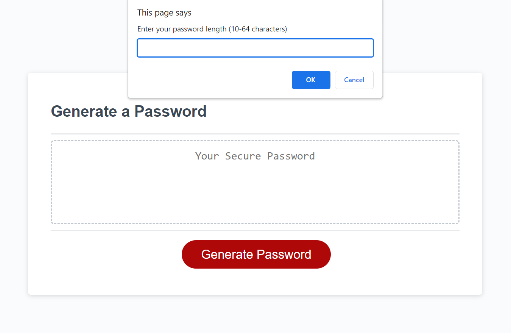

# Password Generator

This project generates a password when the button is clicked. The application can be used by an employee to generate a random password based on criteria they’ve selected. This app runs in the browser, and features dynamically updated HTML and CSS powered by JavaScript code.

## Criteria

- Present a series of prompts for password criteria
  - Length of password
    - At least 10 characters but no more than 64.
  - Character types
    - Lowercase
    - Uppercase
    - Numeric
    - Special characters ($@%&\*, etc)
- Code validates for each input and at least one character type should be selected
- Once prompts are answered then the password is generated and displayed in an alert or written to the page

## Screenshot

## Deployment
